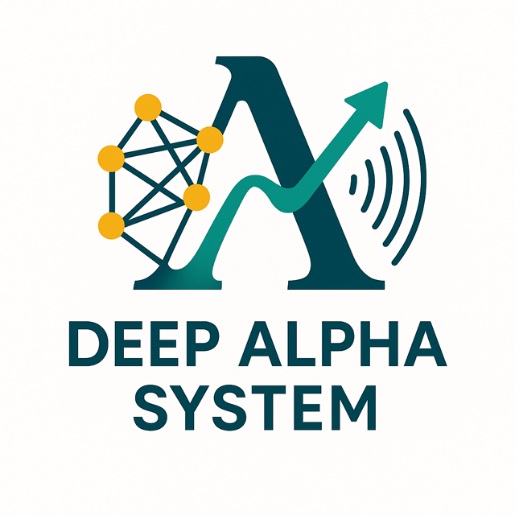

# Deep Alpha System

<p align="center">
  
</p>

**Deep Alpha System** serves as an exploratory environment for those looking to delve into machine learning applications for financial markets and gain hands-on experience with the components of a quantitative trading pipeline. It provides a practical framework for collecting, storing, and analyzing market data (initially from Binance) as a basis for developing and evaluating trading strategies.

The system is designed to:
1.  Define and manage a local list of relevant financial instrument symbols.
2.  Ingest high-resolution kline (candlestick) data (e.g., 1-minute) for these symbols, serving as the source of truth.
3.  Periodically collect order book snapshots for selected symbols.
4.  Store this data efficiently in a TimescaleDB database, leveraging its time-series capabilities.
5.  Automatically create aggregated views (e.g., 5-min, 1-hour, 1-day klines) using TimescaleDB Continuous Aggregates.
6.  Utilize regular Materialized Views for pre-calculating complex or cross-table statistics (e.g., for dashboard performance).
7.  Provide a basic web UI for data visualization and inspection, including performance-optimized overview dashboards.
8.  Offer a structured environment for feature engineering and training ML models (future goal).

**Note:** This project is currently under active development. Core data ingestion and storage functionalities are operational. Feature engineering and machine learning model integration are planned future additions.

## Features

*   **Staged Data Ingestion Workflow:**
    *   **Stage 1 (Symbol Definition):** Updates the local database's `symbols` table from the Binance API based on configurable filters (status, permissions, quote asset).
    *   **Stage 2 (Kline Ingestion):** Fetches historical 1-minute kline data for symbols *already defined* in the local database, with support for concurrent fetching and smart range determination to minimize redundant downloads.
*   **Order Book Collection:** Continuous polling script for collecting order book snapshots at configurable intervals.
*   **Robust Data Storage:**
    *   Utilizes PostgreSQL with the TimescaleDB extension for optimized time-series data handling.
    *   Schema includes tables for exchanges, symbols, raw klines, and order book snapshots.
    *   Hypertables for efficient querying and data management.
*   **Pre-Aggregated Data for Performance:**
    *   **Continuous Aggregates:** Pre-computed aggregated kline views (5m, 10m, 15m, 30m, 1h, 6h, 1d) derived from 1-minute data, automatically refreshed by TimescaleDB.
    *   **Materialized Views:** Additional pre-calculated summaries (e.g., top symbols by kline count, daily ingestion stats) to accelerate dashboard loading. These are refreshed via Makefile commands.
*   **Data Exploration & Visualization:**
    *   A Flask-based web UI to view kline data (raw and aggregated) and order book snapshots.
    *   Symbol statistics (data counts, date ranges) available in the UI.
    *   Overview dashboard with charts showing data distribution and ingestion trends.
*   **Orchestration with Makefile:**
    *   Simplified commands for setting up the database, managing symbols, ingesting data, refreshing data views, running the web UI, and other maintenance tasks.
*   **Dockerized Database:**
    *   TimescaleDB runs in a Docker container for easy setup and portability.

## Project Structure (Overview)

*   `config/`: Contains configuration files (e.g., `config.ini`).
*   `data_ingestion/`: Python scripts for managing symbols and fetching data from Binance.
    *   `manage_symbols.py`: Stage 1 - Updates local symbol definitions.
    *   `populate_db.py`: Stage 2 - Fetches klines for symbols in the local DB.
    *   `kline_ingestor.py`: Core kline fetching and storage logic.
    *   `orderbook_ingestor.py`: Collects order book data.
    *   `utils.py`: Shared utility functions.
    *   `symbol_utils.py`: Utilities like finding top liquid symbols.
*   `db/`: SQL schema definitions (`schema.sql`), including tables, hypertables, continuous aggregates, and materialized views.
*   `web_ui/`: Flask application for the web interface.
*   `Makefile`: For automating common tasks.
*   `docker-compose.yml`: Defines the TimescaleDB service.
*   `requirements.txt`: Python dependencies.


## Prerequisites

*   **Docker and Docker Compose:** For running the TimescaleDB database.
*   **Python 3.8+:** For running the data ingestion scripts and web UI.
*   **Make:** For using the Makefile commands.
*   **Conda (Recommended for environment management):** While optional (you can use `venv` too).
*   **Binance Account (Optional):** API keys are not strictly needed for public data but might provide higher rate limits if used.

## Setup and Installation

1.  **Clone the Repository:**
    ```bash
    git clone https://github.com/NicoLingg/deep_alpha_system.git
    cd deep_alpha_system
    ```

2.  **Set up Python Environment (Conda Recommended):**
    If you don't have Conda, download and install [Miniconda](https://docs.conda.io/en/latest/miniconda.html) or [Anaconda](https://www.anaconda.com/products/distribution).
    ```bash
    # Create a new Conda environment (e.g., named 'deep_alpha_env' with Python 3.9 or higher)
    conda create --name deep_alpha_env python=3.10 -y # Or your preferred Python 3.8+ version
    conda activate deep_alpha_env
    ```
    Activate this environment (`conda activate deep_alpha_env`) every time you work on the project.

3.  **Install Python Dependencies:**
    Ensure your virtual environment is activated.
    ```bash
    pip install -r requirements.txt
    ```

4.  **Configure Passwords and API Keys:**
    *   Copy `config/config.ini.example` to `config/config.ini` if an example file exists, or ensure `config/config.ini` is present.
    *   Open `config/config.ini`:
        *   Update `password` under `[database]`. **This MUST match** `POSTGRES_PASSWORD` in `docker-compose.yml`.
        *   Update `username` and `password` under `[webui_auth]` if you want to protect the Web UI.
        *   Optionally, add your Binance `api_key` and `api_secret` under `[binance]`.
    *   Open `docker-compose.yml` and update `POSTGRES_PASSWORD` to match the database password you set in `config.ini`.
    *   **SECURITY NOTE:** Do not commit `config.ini` with real credentials to a public repository.

5.  **Start Database & Initialize Schema (Combined Target):**
    This command starts the Dockerized TimescaleDB and applies the database schema.
    ```bash
    make setup-db
    ```
    Wait for "Database is ready." and "Database schema applied successfully." If issues occur, check logs: `make logs`.
    *Note: If you update `db/schema.sql` later, re-running `make init-db` (or `make setup-db`) will apply changes. Core data tables will be preserved; materialized views and continuous aggregates will be recreated.*

6.  **Initial Refresh of Materialized Views:**
    After the schema is initialized, some materialized views used for the overview dashboard need an initial population.
    ```bash
    make refresh-custom-mvs
    ```
    Continuous aggregates will start populating automatically based on their policies.

## Usage

The `Makefile` provides convenient targets. Ensure your Python environment is activated. Date parameters (`START_DATE`, `END_DATE`) generally expect specific formats like "YYYY-MM-DD" or "YYYY-MM-DD HH:MM:SS".

### Core Data Ingestion Workflow

**Stage 1: Update Symbol Definitions**
This populates/updates your local `symbols` table from the Binance API.
```bash
make update-symbol-definitions
```
Customize filters (see `Makefile` help or `data_ingestion/manage_symbols.py --help`):
```bash
make update-symbol-definitions SYM_STATUSES="TRADING,END_OF_TRADING" SYM_QUOTE_ASSET="USDT"
```

**Stage 2: Fetch Klines for Defined Symbols**
This fetches kline data for symbols *already in your local database*.
```bash
make fetch-klines-from-db
```
Customize (see `Makefile` help or `data_ingestion/populate_db.py --help`):
```bash
make fetch-klines-from-db KLINE_FETCH_DB_QUOTE_ASSET="USDT" KLINE_FETCH_START_DATE="2022-01-01" KLINE_FETCH_API_STATUS_FILTER=NONE
```

### Other Data Targets

**Fetch Klines for a Single Symbol (Legacy/Direct)**
```bash
make fetch-single-kline SYMBOL=BTCUSDT START_DATE="2023-01-01"
```

**Collect Order Book Snapshots**
Runs continuously. Press `Ctrl+C` to stop.
```bash
make collect-orderbook-snapshots SNAPSHOT_SYMBOL=BTCUSDT
```

**Refresh Data Views**
Manually trigger updates for TimescaleDB continuous aggregates and custom materialized views.
```bash
# Refresh only custom MVs (e.g., for overview dashboard)
make refresh-custom-mvs

# Refresh only TimescaleDB continuous aggregates (kline interval rollups)
make refresh-aggregates

# Refresh both
make refresh-all-data-views
```
It's good practice to run `make refresh-custom-mvs` periodically or after significant data ingestion if you frequently use the overview dashboard.

### Web UI

Start the Flask web interface:
```bash
make webui
```
Access in your browser, typically at `http://localhost:5001` (or as configured in `web_ui/webui.py` and `config.ini`).

It will look like this:


### Database Management

*   **Access psql shell:** `make db-shell`
*   **Stop database container:** `make down`
*   **View database logs:** `make logs`
*   **Clean database data (WARNING: destructive):** `make clean-db-data` (stops container and removes data volume)

## Troubleshooting

*   **Database Connection Issues:**
    *   Ensure Docker container is running (`docker ps`).
    *   Verify passwords match between `config.ini` and `docker-compose.yml`.
    *   Confirm host/port in `config.ini` matches Docker port mapping.
*   **Port Conflicts:**
    *   If port `5433` (DB default) or the WebUI port (default `5001`) is in use, change the host-side port in `docker-compose.yml` (e.g., `"5435:5432"`) and update `config.ini` (`port = 5435`). For WebUI, change in `web_ui/webui.py` or `config.ini` (if supported).
*   **Python `ModuleNotFoundError`:**
    *   Ensure your Python virtual environment is activated.
    *   Run `pip install -r requirements.txt`.
*   **Web UI Errors (e.g., "Source Missing", "DB Error" in tables/charts):**
    *   This can happen if Materialized Views or Continuous Aggregates haven't been created or populated yet.
    *   Run `make init-db` to ensure the schema is fully applied.
    *   Run `make refresh-custom-mvs` to populate dashboard-specific views.
    *   Run `make refresh-aggregates` to help populate kline interval rollups.
    *   Allow some time for TimescaleDB's background policies to run for Continuous Aggregates.
*   **Date Parsing Errors for Kline Ingestion:**
    *   Ensure `START_DATE` and `END_DATE` provided to `make` targets or set in `config.ini` use the format "YYYY-MM-DD" or "YYYY-MM-DD HH:MM:SS".